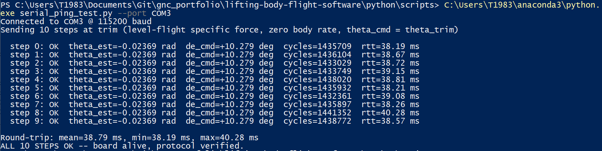

# Lifting-Body GNC: Embedded Flight Software (STM32 PIL)

STM32 Nucleo-F401RE firmware and processor-in-the-loop (PIL)
verification for the HL-20-class lifting-body GNC stack developed in
[**lifting-body-gnc**](https://github.com/Vaiy108/lifting-body-gnc).

**This repo is the embedded-systems half of a two-repo portfolio.** The
physics modeling, navigation/control design, and software-in-the-loop
verification live in `lifting-body-gnc`; this repo takes that
already-verified C flight software and gets it running on real
hardware, with measured cycle-accurate timing.

| | |
|---|---|
| **[lifting-body-gnc](https://github.com/Vaiy108/lifting-body-gnc)** | Aero/atmosphere/dynamics/actuator/sensor/propulsion models (NASA TM-4302 HL-20 aero database), ESKF navigation, pitch-attitude-hold control, MATLAB cross-validation, dependency-free C port, SIL cross-validation |
| **This repo** | Vendored, verified C flight software → STM32CubeIDE project → UART interrupt-driven PIL → measured cycle counts on real Cortex-M4F hardware |

## Why a separate repo

The two repos map onto genuinely different engineering disciplines:
`lifting-body-gnc` covers modeling, estimation, and control design —
verification rigor at the algorithm level; this repo covers bare-metal
embedded implementation — HAL/driver work, real-time behavior, and
measured hardware timing. Splitting them lets each stand on its own as
a focused, reviewable artifact instead of one repo trying to cover
both disciplines at once.

## Verification chain

Every layer here was verified *before* the layer above it touched
hardware:

1. **Python reference** (`lifting-body-gnc`): ESKF navigation +
   pitch-attitude-hold control, tested against physics invariants and
   closed-loop stabilization of a statically-unstable trim point.
2. **Dependency-free C port** (vendored here, `c/`): SIL cross-
   validated against the Python reference to double-precision
   machine-epsilon agreement (~1e-15 to 1e-19). Zero warnings under
   `-Wall -Wextra`, clean under AddressSanitizer, no dynamic
   allocation.
3. **Stack-usage audit**: the ESKF's predict+update call chain
   originally required ~37 KB of stack -- more than a typical
   STM32F401RE budget out of 96 KB total SRAM. Fixed by moving the
   large scratch matrices to `static` storage, cutting worst-case
   usage to ~1.3 KB. Re-verified bit-for-bit identical against the
   same SIL test vectors afterward.
4. **Host-simulated PIL** (`c/pil/host_sim_main.c`): the exact
   platform-independent step function (`pil_core_step()`) that will
   run on the STM32, exercised over the real wire protocol via a
   Linux subprocess standing in for the firmware. Reproduces the
   Python closed-loop demo to 3-4 significant figures.
5. **Hardware PIL** (this repo, `stm32/`): the same `pil_core_step()`,
   same wire protocol, now running on an actual STM32F401RE Nucleo
   over UART, with cycle-accurate timing from the DWT cycle counter.
   *(Status: firmware source and bring-up guide complete; physical
   flash-and-verify in progress -- see status table below.)*


### Hardware bring-up finding: Cortex-M4F unaligned-double hard fault

During STM32 Nucleo-F401RE bring-up, `pil_core_step()` hard-faulted
inside `vec3_sub()` on `eskf_predict()`'s first line — confirmed via
the debugger's call stack. Root cause: `PilInputPacket` is
`#pragma pack(1)` (required so the wire byte layout matches exactly
between PC and target), which places `double` fields at unaligned
memory offsets. x86 (host_sim) handles unaligned double access
transparently, so this was invisible in all host-side SIL/PIL testing.
Cortex-M4F's FPU load instruction (`VLDR`) requires proper alignment;
the compiler generated an aligned load against a misaligned address,
and the hardware faulted.

**Fix:** `pil_core_step()` now `memcpy`s every multi-byte field out of
the packed struct into ordinary, compiler-aligned local variables
before any use — `memcpy` is alignment-safe regardless of source/
destination alignment. Verified numerically identical to the
pre-fix behavior (same SIL test vectors, same host-simulated PIL
result, bit-for-bit unchanged) — confirming the fix changed only how
the data is accessed, not what it computes.

This is exactly the class of bug host-side SIL/PIL testing cannot
catch, and the reason hardware PIL exists as a distinct verification
stage.

## Hardware smoke test

Before running the full 30 s closed-loop scenario, the flashed board
was verified with a lightweight, zero-cross-repo-dependency check
(`serial_ping_test.py`): 10 packets sent at the trim condition baked
into `pil_core_init()`, checking the response against the known-correct
trim values.

```
Connected to COM3 @ 115200 baud
Sending 10 steps at trim (level-flight specific force, zero body rate, theta_cmd = theta_trim)
step 0: OK theta_est=-0.02369 rad de_cmd=+10.279 deg cycles=1435709 rtt=38.19 ms
step 1: OK theta_est=-0.02369 rad de_cmd=+10.279 deg cycles=1436104 rtt=38.67 ms
...
step 9: OK theta_est=-0.02369 rad de_cmd=+10.279 deg cycles=1438772 rtt=38.57 ms
Round-trip: mean=38.79 ms, min=38.19 ms, max=40.28 ms
ALL 10 STEPS OK -- board alive, protocol verified.
```

10/10 steps OK, `theta_est`/`de_cmd` matching the expected trim values
exactly and consistently across every step. Round-trip time stable at
~38-40 ms, giving an early, repeatable baseline before the longer
closed-loop run.

This test was run twice: once before the Cortex-M4F alignment fix
(below), which reliably reproduced the hard fault (zero bytes back,
board silently frozen mid-execution), and once after, which passed
cleanly on the first attempt — useful independent confirmation that
the fix was both necessary and sufficient.




## Status

| Item | Status |
|---|---|
| Vendored C flight software (ESKF, control, protocol) | done |
| Stack-usage fix (37 KB -> 1.3 KB) | done, verified upstream |
| Standalone build in this repo (`make test`) | done |
| STM32 firmware source (`stm32/main_pil_loop.c`) | done |
| CubeMX bring-up guide (`stm32/BRINGUP.md`) | done |
| Standalone hardware smoke test (`serial_ping_test.py`) | done, verified against host-sim |
| CubeIDE project created, firmware flashed |done |
| Hardware PIL run, cycle-count timing captured | done |
| CAN transport (Waveshare USB-CAN + MCP2515) | roadmap |

## Quick start

### 1. Verify the vendored C code builds and passes on your machine

```
cd c
make test
```

Expect 4 `PASS` lines and `ALL SIL CROSS-VALIDATION TESTS PASSED` --
this is the same result already verified in `lifting-body-gnc`; running
it here confirms nothing was altered in vendoring.

### 2. Build the STM32 firmware

Follow [`stm32/BRINGUP.md`](stm32/BRINGUP.md) for the full CubeIDE
walkthrough: creating the project, USART2/stack configuration, adding
the vendored sources, and flashing.

### 3. Smoke-test the flashed board (no cross-repo dependency)

```
pip install pyserial
cd python/scripts
python3 serial_ping_test.py --port COM3        # Windows
python3 serial_ping_test.py --port /dev/ttyACM0  # Linux
```

### 4. Full closed-loop PIL demo against hardware

Requires `lifting-body-gnc` cloned as a sibling directory (this
script drives the 6-DOF plant simulation from that repo):

```
cd python/scripts
PYTHONPATH=../../lifting-body-gnc/python python3 pil_driver.py \
    --backend serial --port COM3
```

## Repository layout

```
lifting-body-flight-software/
├── c/                        vendored from lifting-body-gnc (see file headers)
│   ├── include/                quat_math, matlib, eskf, control, pil_protocol, pil_core
│   ├── src/                    implementations (dependency-free, no malloc)
│   ├── pil/                    pil_core.c, host_sim_main.c
│   ├── test/test_main.c        SIL + protocol test harness
│   ├── test_vectors/           Python-generated reference I/O
│   └── Makefile
├── stm32/
│   ├── main_pil_loop.c          STM32-specific glue: UART + DWT -> pil_core_step()
│   └── BRINGUP.md               step-by-step CubeMX/CubeIDE instructions
├── python/scripts/
│   ├── serial_ping_test.py      standalone hardware smoke test (pyserial only)
│   └── pil_driver.py            full closed-loop demo (needs lifting-body-gnc sibling)
└── docs/                        plots, captures
```

## Vendoring policy

Files under `c/` are copied unmodified from `lifting-body-gnc`, each
with a provenance header stating so. **Do not edit them here** --
fixes and improvements happen upstream in `lifting-body-gnc` and get
re-vendored, so the two repos never silently diverge. Everything under
`stm32/` and the smoke-test script are original to this repo.

## 👤 Author

**Vasan Iyer**  
GNC / Embedded Software Engineer  

Focus areas:
 
- Embedded systems (C++, Python) 
- GNC
- Flight dynamics & control  
- Sensor fusion & state estimation  
- Autonomous systems  
- UAV systems 

GitHub: https://github.com/Vaiy108
Companion repo: https://github.com/Vaiy108/lifting-body-gnc
